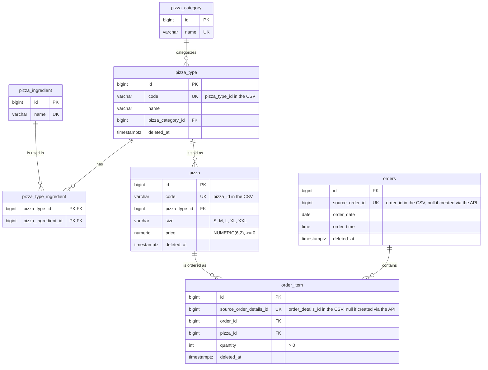

# Pizza Sales API

A Spring Boot application that imports a year of sales from a fictitious pizza place out of CSV files, stores it in
a PostgreSQL schema designed for it, and serves it through a JSON REST API that can also add, change and delete data.

It uses the [Pizza Place Sales](https://www.kaggle.com/datasets/mysarahmadbhat/pizza-place-sales) dataset from
Kaggle: 21,350 orders with 48,620 order lines, over a menu of 32 pizza types sold in 96 sizes and prices.

- [Tech stack](#tech-stack)
- [Getting started](#getting-started)
- [Project structure](#project-structure)
- [Importing data](#importing-data)
- [Database](#database)
- [API](#api)
- [Testing](#testing)
- [Known trade-offs and next steps](#known-trade-offs-and-next-steps)

## Tech stack

- **Java 25** and **Maven** (through the included Maven Wrapper, `./mvnw`)
- **Spring Boot 4.1.1**: Spring Web, Spring Data JPA, Validation, Actuator
- **PostgreSQL 18**, run locally with Docker Compose
- **Flyway** for versioned schema migrations
- **OpenCSV** for reading the CSV files
- **MapStruct** for mapping entities to API responses
- **springdoc-openapi** for the OpenAPI document and Swagger UI
- **JUnit 5**, **Mockito** and **Testcontainers** for tests

## Getting started

### Prerequisites

- JDK 25
- Docker with Docker Compose

No local Maven install is needed.

### Run it

From the repository root:

1. Start PostgreSQL in Docker, with the database and user the app expects.

   ```bash
   docker compose up -d
   ```

2. Create the tables by applying the Flyway migrations. The defaults match [`docker-compose.yml`](docker-compose.yml);
   set the `DB_*` variables (see [Configuration](#configuration)) to use another database.

   ```bash
   export FLYWAY_URL="jdbc:postgresql://${DB_HOST:-localhost}:${DB_PORT:-5432}/${DB_NAME:-pizzasales}"
   export FLYWAY_USER="${DB_USERNAME:-pizzasalesuser}"
   export FLYWAY_PASSWORD="${DB_PASSWORD:-pizzasalespw}"
   export FLYWAY_LOCATIONS="filesystem:src/main/resources/db/migration"
   ./mvnw flyway:migrate
   ```

   The app never runs migrations on startup; see [Migrations](#migrations) for why.

3. Import the menu (pizza types with their categories and ingredients, then pizzas) from the bundled CSV files.

   ```bash
   ./mvnw spring-boot:run -Dspring-boot.run.profiles=import-pizzas
   ```

4. Import the sales (orders, then their order lines). This needs the menu from step 3.

   ```bash
   ./mvnw spring-boot:run -Dspring-boot.run.profiles=import-orders
   ```

5. Start the API on http://localhost:8080.

   ```bash
   ./mvnw spring-boot:run
   ```

   - **Swagger UI**, to browse and call the endpoints: http://localhost:8080/swagger-ui.html
   - **Health check**: http://localhost:8080/actuator/health

### Configuration

The database connection is set with environment variables. The defaults match `docker-compose.yml`:

| Variable | Default |
|---|---|
| `DB_HOST` | `localhost` |
| `DB_PORT` | `5432` |
| `DB_NAME` | `pizzasales` |
| `DB_USERNAME` | `pizzasalesuser` |
| `DB_PASSWORD` | `pizzasalespw` |

The import's own settings (input files and chunk size) are described in [Importing data](#importing-data). All
settings live in [`application.yml`](src/main/resources/application.yml).

## Project structure

```
src/main/java/com/karlobathan/pizzasales
├── api                    REST API
│   ├── controller         HTTP endpoints, request validation, OpenAPI annotations
│   ├── service            business logic behind interfaces (PizzaService, OrderService, ...)
│   ├── repository         Spring Data JPA repositories and their queries
│   ├── domain             JPA entities
│   ├── dto                request and response records
│   ├── mapper             MapStruct mappers from entities to responses
│   ├── exception          exceptions and the handler that turns them into problem details
│   └── config             OpenAPI setup and shared error responses
└── importer               CSV import jobs
    ├── config             import settings and the profile-based job runners
    ├── loader             streaming CSV reader
    ├── row                CSV row beans
    ├── runner             runs a job, then exits with its status code
    └── service            one import service per file, plus orchestrators per job
```

The importer and the API share only the entities and repositories (in `api`), so either side can change without
touching the other.

## Importing data

### How it works

The CSV files are loaded by two one-off jobs. Each job is the same application started with a Spring profile: it
runs the import and exits, without starting a web server. The commands are steps 3 and 4 of [Run it](#run-it).

| Job | Profile | Imports, in this order |
|---|---|---|
| Pizza import | `import-pizzas` | pizza types (with their categories and ingredients), then pizzas |
| Order import | `import-orders` | orders, then order details |

- **Run the pizza import first.** Order details reference pizzas, so the order import fails with
  `references unknown pizza` if the menu isn't in the database yet.
- **Run the jobs as separate commands.** Each job exits the application when it finishes, so activating both
  profiles at once would never start the second one.
- **Exit codes** are `0` on success and `1` on failure, so the jobs can be scripted or run in a pipeline.
- **Imports are safe to re-run.** Rows whose CSV id (`pizza_type_id`, `pizza_id`, `order_id` or `order_details_id`)
  is already in the database are skipped and left unchanged, including rows deleted through the API. Each job logs
  what it did:

  ```
  Imported 21350 new orders (0 already existed)
  Imported 0 new orders (21350 already existed)
  ```

- **Large files are saved in chunks.** Orders and order details are saved `app.import.chunk-size` rows at a time
  (default `1000`, environment variable `APP_IMPORT_CHUNKSIZE`), each chunk in its own transaction, so memory use
  stays the same however large the file is. If a run fails partway through, the chunks saved before the failure stay
  saved: fix the cause and run the same job again, and it carries on from where it stopped.

### Input files

| File | Property | Environment variable | Default | Columns |
|---|---|---|---|---|
| Pizza types | `app.import.pizzas.types-file` | `APP_IMPORT_PIZZAS_TYPESFILE` | `classpath:data/pizza_types.csv` | `pizza_type_id,name,category,ingredients` |
| Pizzas | `app.import.pizzas.file` | `APP_IMPORT_PIZZAS_FILE` | `classpath:data/pizzas.csv` | `pizza_id,pizza_type_id,size,price` |
| Orders | `app.import.orders.file` | `APP_IMPORT_ORDERS_FILE` | `classpath:data/orders.csv` | `order_id,date,time` |
| Order details | `app.import.orders.details-file` | `APP_IMPORT_ORDERS_DETAILSFILE` | `classpath:data/order_details.csv` | `order_details_id,order_id,pizza_id,quantity` |

Files are UTF-8 with a header row matching these columns. The defaults are the copies bundled in
[`src/main/resources/data`](src/main/resources/data).

- `ingredients` is a quoted, comma-separated list, e.g. `"Chicken, Tomatoes, Garlic"`.
- Categories and ingredients are created on first use and matched ignoring case, so `Chicken` and `chicken` are the
  same category.
- `size` is one of `S`, `M`, `L`, `XL`, `XXL`; `date` is `yyyy-MM-dd` and `time` is `HH:mm:ss`.
- Every reference must resolve: a pizza's `pizza_type_id`, an order detail's `order_id`, and an order detail's
  `pizza_id` must be in the same import's files or already in the database.

### Using your own files

Set a file's property to a Spring resource location:

- `file:/absolute/path/orders.csv`: a file on disk (`file:relative/path.csv` resolves against the working directory)
- `classpath:data/orders.csv`: a file on the classpath

Files you don't override keep their defaults. Pass the override in whichever way suits you:

```bash
./mvnw spring-boot:run -Dspring-boot.run.profiles=import-orders \
  -Dspring-boot.run.arguments="--app.import.orders.file=file:/data/orders.csv --app.import.orders.details-file=file:/data/order_details.csv"
```

```bash
APP_IMPORT_ORDERS_FILE=file:/data/orders.csv APP_IMPORT_ORDERS_DETAILSFILE=file:/data/order_details.csv \
./mvnw spring-boot:run -Dspring-boot.run.profiles=import-orders
```

```bash
java -jar target/pizzasalesapi-0.0.1-SNAPSHOT.jar --spring.profiles.active=import-orders \
  --app.import.orders.file=file:/data/orders.csv --app.import.orders.details-file=file:/data/order_details.csv
```

Environment variable names are the property name in upper case, with dots as underscores and dashes removed. The jar
is built with `./mvnw package`. If a file can't be read, the job logs `Failed to read CSV file at <location>` and
exits with code `1`.

## Database

### Schema



### Why this schema

The four CSV files already describe a menu and the sales against it. The schema keeps that shape and normalizes the
parts the CSVs repeat or pack into strings:

- **Categories and ingredients are tables of their own.** In `pizza_types.csv`, the category is repeated on every row
  and the ingredients are one comma-separated string. Storing them once, with a many-to-many join table
  (`pizza_type_ingredient`), avoids duplicated spellings and turns questions like "which pizzas contain garlic" into
  a join instead of string matching.
- **A pizza type is the recipe; a pizza is one size and price of it**, the same split as `pizza_types.csv` and
  `pizzas.csv`. Size and price live only on `pizza`, so a price change is one row and every order line points at
  exactly one priced variant. A unique index allows only one pizza per type and size (deleted pizzas aside).
- **An order is a header; its lines are `order_item` rows**, matching `orders.csv` (when) and `order_details.csv`
  (what). Totals aren't stored but computed from quantity × price, so there's no copy to keep in sync. The table is
  called `orders` because `ORDER` is a reserved SQL word.
- **Surrogate keys, with the CSV ids kept as unique natural keys.** Every table has its own `BIGINT` id, so the
  database doesn't depend on the dataset's id format. The CSV ids are kept in unique columns (`code`,
  `source_order_id`, `source_order_details_id`) that the importer matches on, which makes every import idempotent.
  Rows created through the API have no CSV id.
- **Deletes are soft.** `deleted_at` marks a deleted row instead of removing it, for two reasons. A hard-deleted
  imported row would lose its CSV id and come back on the next import; a soft-deleted one keeps it, so the import
  leaves it alone. And past orders keep showing the pizza they were placed with after it leaves the menu. Hibernate
  hides deleted orders and order items from every query automatically; deleted pizzas and pizza types are filtered
  out explicitly by the menu queries, because orders still need to load them.
- **Types and constraints match the data.** Prices are exact `NUMERIC(6, 2)`, never floating point. Order date and
  time are separate `DATE` and `TIME` columns as in the CSV. `CHECK` constraints keep prices non-negative and
  quantities positive.
- **Indexes for the lookups that matter.** Postgres doesn't index foreign keys automatically, so the ones queries join
  on (pizza type → category, pizza → pizza type, order item → order and → pizza) have indexes, plus
  `orders (order_date)` for the date-range search.

### Migrations

The schema is created and changed by Flyway migrations in
[`src/main/resources/db/migration`](src/main/resources/db/migration). The app has `spring.flyway.enabled: false`, so
it never migrates on startup. That's deliberate: in a real deployment, schema changes run as their own pipeline step
before the new version rolls out, instead of several app instances racing to apply DDL on boot.

Migrations are never edited once merged; each change is a new version.

## API

All endpoints use JSON. The full, interactive reference is the Swagger UI at http://localhost:8080/swagger-ui.html,
generated from the OpenAPI document at `/v3/api-docs`.

### Endpoints

| Resource | Endpoint | Description |
|---|---|---|
| Pizza types | `GET /api/pizza-types` | Every pizza type on the menu, with its category and ingredients |
| | `GET /api/pizza-types/{id}` | One pizza type |
| | `POST /api/pizza-types` | Create a pizza type; category and ingredients are given by name and created if new |
| | `PUT /api/pizza-types/{id}` | Replace the name, category and ingredients |
| | `DELETE /api/pizza-types/{id}` | Delete a pizza type whose pizzas are all deleted |
| Pizzas | `GET /api/pizzas` | Every pizza (size and price variant), with a summary of its pizza type |
| | `GET /api/pizzas/{id}` | One pizza |
| | `POST /api/pizzas` | Create a pizza for a pizza type |
| | `PUT /api/pizzas/{id}` | Replace the pizza type, size and price |
| | `DELETE /api/pizzas/{id}` | Delete a pizza; past orders still show it |
| Orders | `GET /api/orders` | Search orders: paginated, optionally filtered by date range |
| | `GET /api/orders/{id}` | One order with its items, total quantity and total price |
| | `POST /api/orders` | Create an order with its items |
| | `PUT /api/orders/{id}` | Replace an order's date, time and items |
| | `DELETE /api/orders/{id}` | Delete an order |

For example, to create an order with pizza ids from `GET /api/pizzas`:

```bash
curl -i -X POST http://localhost:8080/api/orders -H 'Content-Type: application/json' -d '{
  "orderDate": "2015-12-31",
  "orderTime": "18:30:00",
  "items": [{"pizzaId": 1, "quantity": 2}, {"pizzaId": 5, "quantity": 1}]
}'
```

### Conventions

- **Searching orders:** `GET /api/orders` takes `from` and `to` (inclusive dates, both optional), `page` (from 0)
  and `size` (1 to 100, default 20). Results are sorted by date, then time, then id, and come back as
  `{"content": [...], "page", "size", "totalElements", "totalPages"}`. The menu is small, so its lists are plain arrays.
- **Formats:** dates are `yyyy-MM-dd`, times `HH:mm:ss`, and prices with two decimals.
- **Status codes:** creating returns `201 Created` with the new resource and a `Location` header, replacing returns
  `200` with the updated resource, and deleting returns `204 No Content`.
- **PUT replaces the whole resource; there is no PATCH.** Orders and menu items are small, so sending the whole
  resource back is cheap, and it avoids ambiguous partial-update rules for an order's list of items.
- **Codes are fixed.** A pizza's or pizza type's `code` is the key the import matches on, so it's set on creation
  and can't be changed. A code stays taken even after its row is deleted.
- **Writes are all-or-nothing.** Every referenced pizza or pizza type is checked before anything changes, so a
  rejected request leaves the data as it was.
- **Deleted resources are gone from the API.** They no longer appear in lists, and getting, replacing or deleting them
  returns `404`. New orders can't use a deleted pizza, and new pizzas can't use a deleted pizza type. See
  [Why this schema](#why-this-schema) for how soft deletes work underneath.

### Errors

Every error is an [RFC 9457](https://www.rfc-editor.org/rfc/rfc9457) problem detail, sent as
`application/problem+json`:

```json
{
  "title": "Resource not found",
  "status": 404,
  "detail": "Order with id 99 not found",
  "instance": "/api/orders/99"
}
```

| Status | When |
|---|---|
| `400 Bad Request` | An invalid body, query parameter or path id, or an unknown pizza or pizza type in a request body |
| `404 Not Found` | No resource with this id, or it was deleted |
| `409 Conflict` | A code already in use, a size the pizza type already has, or deleting a pizza type that still has pizzas |

A request body that fails validation lists every invalid field:

```json
{
  "title": "Invalid request",
  "status": 400,
  "detail": "The request body has invalid fields",
  "instance": "/api/orders",
  "errors": [
    {"field": "items[0].quantity", "message": "must be greater than 0"},
    {"field": "orderDate", "message": "must not be null"}
  ]
}
```

## Testing

```bash
./mvnw verify
```

That runs every test. They're split by name, so each kind can also run on its own:

| Kind | Name ends in | Run with | Needs Docker |
|---|---|---|---|
| Unit and web slice tests | `Test` (run by Surefire) | `./mvnw test` | No |
| Integration tests | `IT` (run by Failsafe) | `./mvnw verify -DskipUnitTests` | Yes |

- **Unit tests** cover the services, mappers and import logic, with Mockito.
- **Web slice tests** (`@WebMvcTest`) cover each controller: status codes, JSON shapes, validation and error bodies.
- **Integration tests** start PostgreSQL in [Testcontainers](https://testcontainers.com), apply the real migrations,
  load small fixture CSVs with the real importers, and call the API end to end. They also check that every error
  example in the OpenAPI document matches the response the API actually returns.

[GitHub Actions](.github/workflows/ci.yml) runs the unit and integration tests as two parallel jobs on every pull
request and every push to `main`.

## Known trade-offs and next steps

- **Order totals use the current price.** The dataset has no price history, so totals are computed from today's
  `pizza.price`, and changing a price also changes past orders' totals. A production system would store the price on
  each `order_item` when the order is placed.
- **Concurrent edits are last-write-wins.** Two clients replacing the same order or pizza at once can overwrite each
  other. Optimistic locking (a `@Version` column with `ETag` / `If-Match`) would prevent that.
- **Simultaneous creates can return 500.** Duplicate codes and sizes are checked before saving, but two requests
  racing with the same code can both pass the check; the database's unique constraint then rejects the second as a
  500 instead of a 409. Translating that constraint error into a 409 would close the gap.
- **No undelete.** Restoring a deleted row means setting `deleted_at` back to `NULL` in the database. Replacing an
  order keeps its old items as deleted rows, so its history grows with each `PUT`.
- **Native SQL must filter deleted rows itself.** The automatic filtering on orders and order items applies to JPQL
  queries only. The importer's native queries rely on that to see deleted rows; any new native query has to decide
  explicitly.
- **Imports only add rows.** Re-running an import never updates existing rows, so a corrected CSV value (a price,
  say) doesn't overwrite what's in the database. A new CSV pizza for a pizza type deleted through the API would still
  be imported.
- **Imported pizza type ids don't follow the CSV order**, because the pizza type import collects new types in a set
  before saving them.
- **Errors for `page` and `size`** use Spring's generic `Validation failure` message, without naming the parameter.
- **Not built yet:** the challenge's bonus tasks. That's statistics endpoints (for example revenue by month,
  best-selling pizzas, busiest hours and average order value), which are mostly new read queries on the existing
  schema, plus authentication with request quotas.
